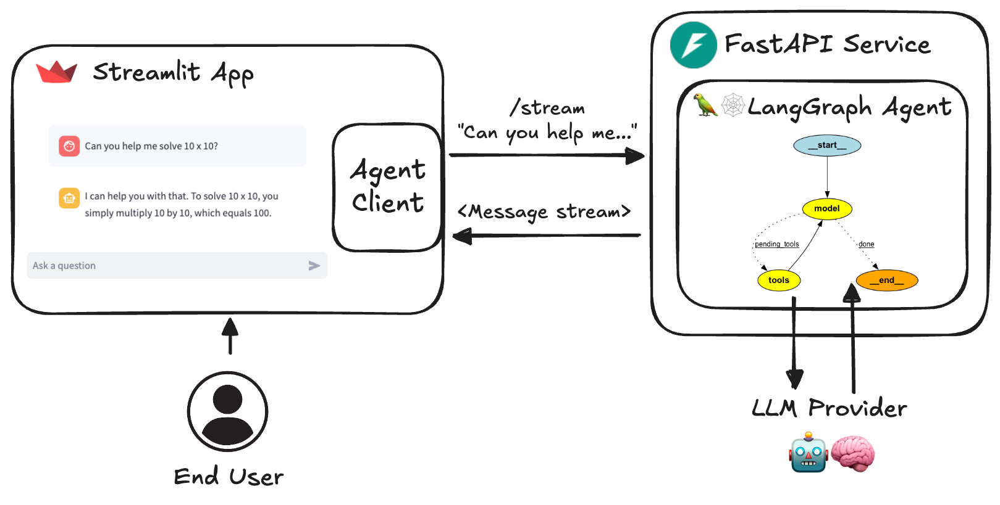

# Multi-User Document Search and Conversational Q&A System

A full toolkit for running a conversational Q&A System built with LangGraph, FastAPI and Streamlit.

It includes a [LangGraph](https://langchain-ai.github.io/langgraph/) agent, a [FastAPI](https://fastapi.tiangolo.com/) service to serve it, a client to interact with the service, and a [Streamlit](https://streamlit.io/) app that uses the client to provide a chat interface. Data structures and settings are built with [Pydantic](https://github.com/pydantic/pydantic).

This project offers a template for you to easily build and run your own agents using the LangGraph framework. It demonstrates a complete setup from agent definition to user interface, making it easier to get started with LangGraph-based projects by providing a full, robust toolkit.

## Overview
This system allows multiple users to query a collection of text documents and retrieve relevant excerpts based on their queries. Each user has restricted access to specific documents, ensuring they can only retrieve answers from the files they are authorized to view. Additionally, the system provides a conversational Q&A experience, where follow-up questions maintain context from previous interactions. The system includes a basic user interface (UI) for easy interaction.

## System Context

### 1. Documents
To replicate the scenario, we use publicly available earnings call PDFs from 4–5 companies as the document dataset. User-specific access control is simulated as follows:
- Each user (represented by dummy email IDs) is allowed to access documents for only one or two companies.
:
```sh
   #### User access control
    user_access = {
            "user1@example.com": ["Amazon.pdf", "IBM.pdf", "IBM2.pdf"],
            "user2@example.com": ["JPMC.pdf", "Wells.pdf"],
            "user3@example.com": ["Alphabet.pdf", "JPMC.pdf", "IBM.pdf","IBM2.pdf"],
        }
```
### 2. Functionality

- **Query and Retrieval**: Users can query the system and retrieve relevant excerpts from documents they have access to. The system uses Chroma vectorstore to implement a naive RAG pipeline.
- **Conversational Experience**: The system maintains context from previous user queries and answers, providing a conversational experience. LangGraph is used to build a context-aware, stateful conversation system.
- **User Isolation**: Queries and responses are isolated per user, ensuring User 1 does not see answers from documents User 2 has access to. This is achieved by using vectorstore pre-filtering, which filters chunks based on the user before searching for vector similarity.

- **Basic UI**: A basic UI is implemented using Streamlit, allowing users to:
   - Log in (very basic) or simulate access using their email IDs.
   - Submit queries and view retrieved answers.
   - Follow up with context-aware questions.

### 3. Multi-User Access

- The system is designed to handle simultaneous access by multiple users. Queries from different users do not interfere with each other. Asynchronous programming is used to handle the concurrency of requests for inference.

## Implementation Highlights

### User Authentication and Access Control

- User authentication and access control are implemented in the Streamlit UI.
- Each user is restricted to accessing specific documents based on their email ID.

### Document Retrieval

- The `retrieve` function filters document search results based on user permissions.
- Ensures that only authorized documents are retrieved for each user.

### Conversational Context

- Maintains conversation context per user with thread IDs.
- Ensures follow-up questions are context-aware.

### Source Attribution

- Displays retrieved sources with metadata in the UI.
- Ensures responses are backed with citations or references from the provided documents.

### Error Handling

- Proper error handling and logging are added to capture detailed error information.
- Ensures graceful failure responses instead of raising exceptions.

This system meets all the specified requirements, providing a robust and user-friendly multi-user document search and conversational Q&A experience.


### Quickstart

Run directly in python

```sh
# At least one LLM API key is required
echo 'OPENAI_API_KEY=your_openai_api_key' >> .env

# uv is recommended but "pip install ." also works
pip install uv
uv sync --frozen
# "uv sync" creates .venv automatically
source .venv/bin/activate
python src/run_service.py

# In another shell
source .venv/bin/activate
streamlit run src/streamlit_app.py
```

Run with docker

```sh
echo 'OPENAI_API_KEY=your_openai_api_key' >> .env
docker compose watch
```

### Architecture Diagram



### Key Features

1. **LangGraph Agent**: A customizable agent built using the LangGraph framework.
1. **FastAPI Service**: Serves the agent with both streaming and non-streaming endpoints.
1. **Streamlit Interface**: Provides a user-friendly chat interface for interacting with the agent.
1. **Asynchronous Design**: Utilizes async/await for efficient handling of concurrent requests.
1. **Dynamic Metadata**: `/info` endpoint provides dynamically configured metadata about the service and available agents and models.

### Key Files

The repository is structured as follows:

- `src/agents/`: Defines several agents with different capabilities
- `src/schema/`: Defines the protocol schema
- `src/core/`: Core modules including LLM definition and settings
- `src/service/service.py`: FastAPI service to serve the agents
- `src/client/client.py`: Client to interact with the agent service
- `src/streamlit_app.py`: Streamlit app providing a chat interface

### Detailed File Explanations

#### `src/streamlit_app.py`

This file sets up a Streamlit app for interacting with the LangGraph agent via a simple chat interface. It includes three main functions:

- `main()`: Sets up the Streamlit app and high-level structure.
- `draw_messages()`: Draws a set of chat messages, either replaying existing messages or streaming new ones.


Example:
```python
async def main() -> None:
    st.set_page_config(page_title=APP_TITLE, page_icon=APP_ICON)
    # ...existing code...
    if "agent_client" not in st.session_state:
        agent_url = os.getenv("AGENT_URL", "http://localhost")
        st.session_state.agent_client = AgentClient(agent_url)
    # ...existing code...
```

#### `src/service/service.py`

This file defines the FastAPI service to serve the agents. It includes endpoints for invoking agents, retrieving chat history, and recording feedback.

Example:
```python
@router.post("/{agent_id}/invoke")
async def invoke(user_input: UserInput, agent_id: str = DEFAULT_AGENT) -> ChatMessage:
    agent: CompiledStateGraph = get_agent(agent_id)
    kwargs, run_id = _parse_input(user_input)
    try:
        response = await agent.ainvoke(**kwargs)
        output = langchain_to_chat_message(response["messages"][-1])
        output.run_id = str(run_id)
        return output
    except Exception as e:
        logger.error(f"An exception occurred: {e}")
        raise HTTPException(status_code=500, detail="Unexpected error")
```

#### `src/client/client.py`

This file defines the `AgentClient` class, which is used to interact with the agent service. It supports both synchronous and asynchronous invocations, as well as streaming and non-streaming requests.

Example:
```python
class AgentClient:
    async def ainvoke(self, message: str, model: str | None = None, thread_id: str | None = None, custom_data: list[dict] | None = None) -> ChatMessage:
        request = UserInput(message=message, thread_id=thread_id, model=model, custom_data=custom_data)
        async with httpx.AsyncClient() as client:
            response = await client.post(f"{self.base_url}/{self.agent}/invoke", json=request.model_dump(), headers=self._headers, timeout=self.timeout)
            response.raise_for_status()
        return ChatMessage.model_validate(response.json())
```

#### `src/agents/tools.py`

This file contains utility functions for processing PDF files and updating the vector store. It includes functions to load and process PDFs, split text into chunks, and update or create a vector store.

Example:
```python
def process_pdfs(pdf_files: List[Path], embeddings, vectorstore: Optional[Chroma] = None, collection_name: str = "rag-chroma") -> Chroma:
    text_splitter = RecursiveCharacterTextSplitter(chunk_size=1000, chunk_overlap=200)
    docs = []
    for pdf in pdf_files:
        pdf_name = pdf.name
        pdf_pages = load_pdf(pdf)
        for user, accessible_pdfs in user_access.items():
            if pdf_name in accessible_pdfs:
                for page in pdf_pages:
                    page.metadata["user"] = user
                    docs.append(page)
    text_splits = text_splitter.split_documents(docs)
    if vectorstore is None:
        vectorstore = Chroma.from_documents(documents=text_splits, collection_name=collection_name, embedding=embeddings, persist_directory="./chroma_langchain_db")
    else:
        vectorstore.add_documents(text_splits)
    return vectorstore
```

#### `src/agents/chatbot.py`

This file defines the chatbot agent using LangGraph. It includes functions to retrieve relevant content based on user queries and generate answers using a language model.

Example:
```python
async def retrieve(state: AgentState, config: RunnableConfig) -> AgentState:
    query = state["messages"][-1].content
    state["query"] = query
    data = config["configurable"].get("custom_data", [])
    user = data[0].get("user") if data else None
    if not user:
        state["retrieved_docs"] = []
        return state
    search_kwargs = {"filter": {"user": user}} if user else {}
    results = await vectorstore.asimilarity_search(query, k=3, filter={"user": user})
    state["retrieved_docs"] = results
    return state
```


## Setup and Usage

1. Clone the repository:

   ```sh
   git clone https://github.com/JoshuaC215/agent-service-toolkit.git
   cd agent-service-toolkit
   ```

2. Set up environment variables:
   Create a `.env` file in the root directory. At least one LLM API key or configuration is required. See the [`.env.example` file](./.env.example) for a full list of available environment variables, including a variety of model provider API keys, header-based authentication, LangSmith tracing, testing and development modes, and OpenWeatherMap API key.

3. You can now run the agent service and the Streamlit app locally, either with Docker or just using Python. The Docker setup is recommended for simpler environment setup and immediate reloading of the services when you make changes to your code.

### Local development env

You can also run the agent service and the Streamlit app locally without Docker, just using a Python virtual environment.

1. Create a virtual environment and install dependencies:

   ```sh
   pip install uv
   uv sync --frozen
   source .venv/bin/activate
   ```

2. Run the code for  information retrieval for PDF documents and load vectorstore with embeded chunks:
   Downoads embedding model from huggingface! Takes some time...
   ```sh
   python src/agents/tools.py
   ```
3. Run the FastAPI server:

   ```sh
   python src/run_service.py
   ```
4. In a separate terminal, run the Streamlit app:

   ```sh
   streamlit run src/streamlit_app.py
   ```

5. Open your browser and navigate to the URL provided by Streamlit (usually `http://localhost:8501`).


### Contributing

Currently the tests need to be run using the local development without Docker setup. To run the tests for the agent service:

1. Ensure you're in the project root directory and have activated your virtual environment.

2. Install the development dependencies and pre-commit hooks:

   ```sh
   pip install uv
   uv sync --frozen
   pre-commit install
   ```

## Customization

To customize the agent for your own use case:

1. Add your new agent to the `src/agents` directory. You can copy `research_assistant.py` or `chatbot.py` and modify it to change the agent's behavior and tools.
2. Import and add your new agent to the `agents` dictionary in `src/agents/agents.py`. Your agent can be called by `/<your_agent_name>/invoke` or `/<your_agent_name>/stream`.
3. Adjust the Streamlit interface in `src/streamlit_app.py` to match your agent's capabilities.

## Building other apps on the AgentClient

The repo includes a generic `src/client/client.AgentClient` that can be used to interact with the agent service. This client is designed to be flexible and can be used to build other apps on top of the agent. It supports both synchronous and asynchronous invocations, and streaming and non-streaming requests.
